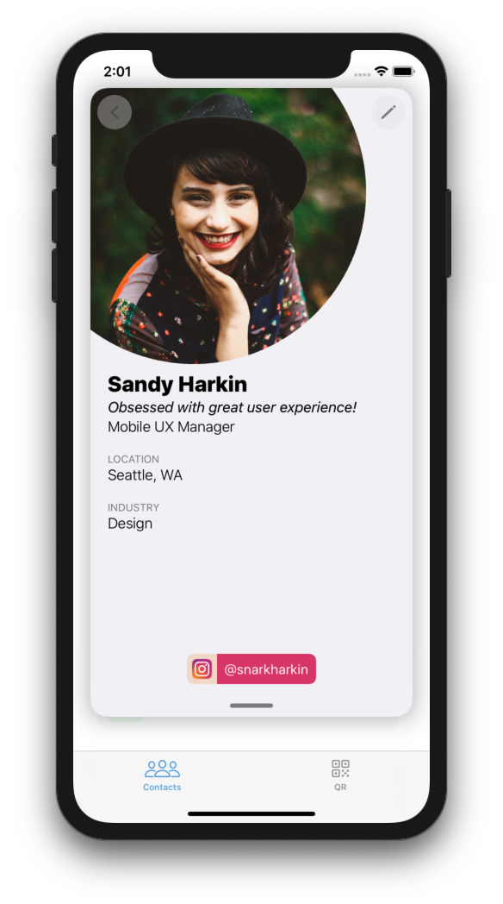
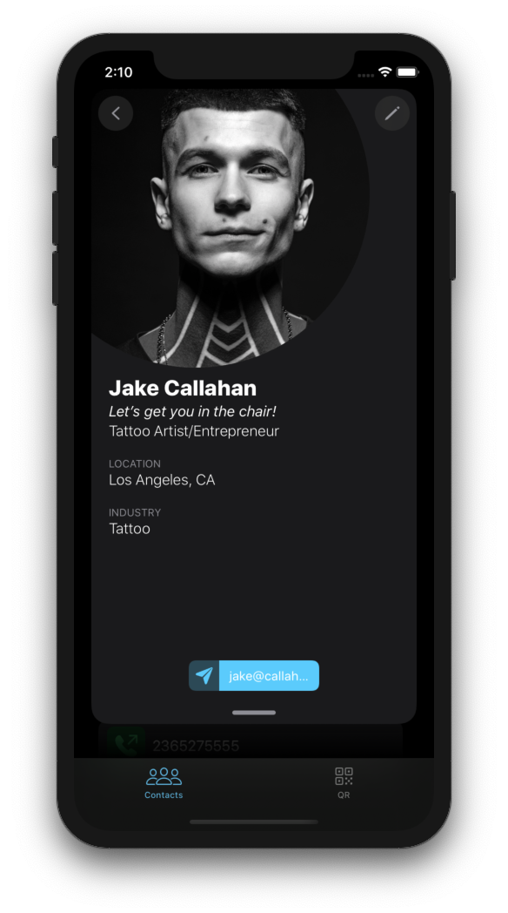
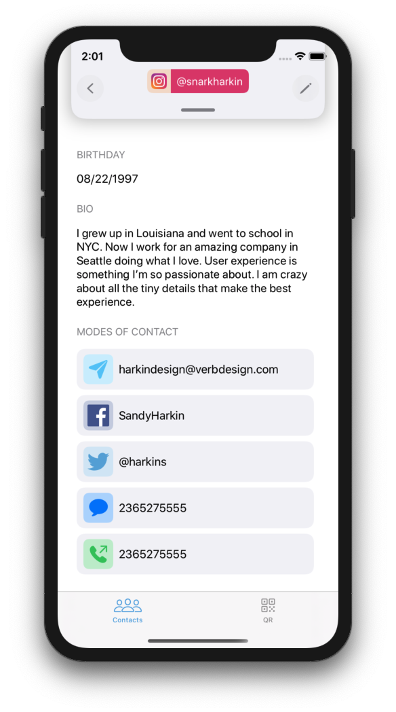

## 9 Contributors

| [Marlon Raskin][MarlonLink]                       				                                           	| [Michael Redig][MichaelLink]                                                                                  | [Jonathan Picazzo][JonathanLink]                       				                                        | [Bobby Hall][BobbyLink]                                                                                  		| [Tyler Quinn][QuinnLink]                       				                                           		| [Emily Arias][EmilyLink]                                                                                  	| [Jarvise Billups][JarviseLink]                       				                                        	| [Tyler Nishida][TylerLink]                                                                                  	| [Zachary Peasley][ZackLink]                       				                                           	|	
| :-----------------------------------------------------------------------------------------------------------: | :-----------------------------------------------------------------------------------------------------------: | :-----------------------------------------------------------------------------------------------------------: | :-----------------------------------------------------------------------------------------------------------: | :-----------------------------------------------------------------------------------------------------------: | :-----------------------------------------------------------------------------------------------------------: | :-----------------------------------------------------------------------------------------------------------: | :-----------------------------------------------------------------------------------------------------------: | :-----------------------------------------------------------------------------------------------------------: |
| [][MarlonLink]	 	| [][MichaelLink]	 	| [][JonathanLink]	 	| [][BobbyLink]	 		| [][QuinnLink]	 		| [][EmilyLink]	 	| [][JarviseLink]	 	| [][TylerLink]	 		| [][ZackLink]	 	|
| [ ][MarlonLink]	                     					| [ ][MichaelLink]	                               			| [ ][JonathanLink]	                     				| [ ][BobbyLink]	                               			| [ ][QuinnLink]	                     					| [ ][EmilyLink]	                               			| [ ][JarviseLink]	                     					| [ ][TylerLink]	                               			| [ ][ZackLink]	                     					|

[![Swift Version][swift-image]][swift-url]	[![License][license-image]][license-url]	

## Project Overview

* You can find the deployed project at [Swaap on TestFlight](https://appstoreconnect.apple.com/WebObjects/iTunesConnect.woa/ra/ng/app/1489988902/testflight?section=build&subsection=testers&id=58839d93-df6a-4175-9163-018050500150).

* [Trello Board](https://trello.com/b/Jh8cS46t/conference-contacts)

* [Product Canvas](https://www.notion.so/Release-1-0-Auth-User-Profile-7abf0ffafe804fc88e9af40ed335f17b)

* [UX Design files](https://www.figma.com/file/CkvwWMzxcI4lI4udHm8QiH/Labs18_Conference-Contacts%2C-Emily%2CTylerr?node-id=211%3A5)

Swaap is an app to help professional people make great contacts at events such as conferences, conventions, or trade shows. A lot of times it can be difficult to keep track of the people you've added to your network. Swaap makes it super easy to swap contact information with others and keep in touch. Easy QR code reader or NFC will automatically redirect you to that person's profile page where you are shown many different ways to connect with that person. Their profile will even let you know what the best way to get in touch with them.

 
 

### Features

-    Connect to other users easily via NFC or QR code/reader
-    Easily keep tabs on how well you are keeping in touch with your professional contacts
-    Keep track of how you met your contacts and notes about them or how you met
-    swaap acts as a hub for all the ways you can be contacted by the people in your network

### Authentication API - Auth0

Auth0 provides a universal authentication & authorization platform for web, mobile and legacy applications.

Using Auth0, developers can connect any application written in any language or stack, and define the external identity providers, as well as integrations, that they want to use.

### Cloudinary API

Securely upload & store as many images and videos as needed, at any scale, from any source. Use a powerful API for fast upload directly from users’ browsers or mobile apps. Rest easy with auto-backups, historical revisions, and flexible storage options.

## Requirements

-   iOS 13.0+
-   Xcode 11.0
-   Carthage

## Contribution

Please go [here](Contributing.md)

## Documentation

See [Backend Documentation](https://github.com/Lambda-School-Labs/conference-contacts-be/blob/staging/schema.md) for details on the backend of our project.

See [Frontend Here](https://github.com/Lambda-School-Labs/conference-contacts-fe)

<!-- Names + GitHub -->
[MarlonLink]: https://github.com/marlonjames71
[MichaelLink]: https://github.com/mredig
[JonathanLink]: https://github.com/macjabeth
[BobbyLink]: https://github.com/bobbyhalljr
[QuinnLink]: https://github.com/Bangstry
[EmilyLink]: https://github.com/Ehuntwork
[JarviseLink]: https://github.com/Fullmetal235
[TylerLink]: https://github.com/tylernishida
[ZackLink]: https://github.com/zpallday

<!-- Photos -->
[MarPhoto]: 
[MarlonPhoto]: https://ca.slack-edge.com/T4JUEB3ME-UHUR873EV-d88881406d1d-512
[MichaelPhoto]: https://ca.slack-edge.com/T4JUEB3ME-UHF67A9T9-a3fb05aba2cd-512
[JonathanPhoto]: https://avatars0.githubusercontent.com/u/8473052?s=400&v=4
[BobbyPhoto]: https://avatars1.githubusercontent.com/u/29504858?s=400&v=4
[QuinnPhoto]: https://avatars3.githubusercontent.com/u/52711778?s=400&v=4
[EmilyPhoto]: https://ca.slack-edge.com/T4JUEB3ME-UGVBY5QK0-0322eb799fbf-512
[JarvisePhoto]: https://ca.slack-edge.com/T4JUEB3ME-UHV013MQF-3a9d77644b52-512
[TylerPhoto]: https://avatars3.githubusercontent.com/u/49229588?s=400&v=4
[ZackPhoto]: https://ca.slack-edge.com/T4JUEB3ME-UJG8RLWKG-3766d295008c-512

<!-- Badges -->
[swift-image]: https://img.shields.io/badge/swift-5.1-orange.svg
[swift-url]: https://swift.org/
[license-image]: https://img.shields.io/badge/License-MIT-blue.svg
[license-url]: LICENSE
